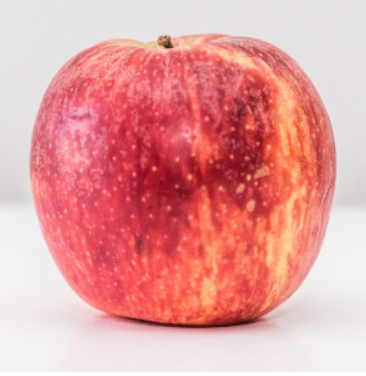

# Java Image Processing Project

## 📌 Overview
This project performs image processing using Java.
It manipulates images using pixel-level operations using 2D arrays.

## 🚀 Features
- Negative filter
- RGB color adjustment
- Image cropping (trim borders)
- Horizontal stretching
- Vertical shrinking
- Image inversion (flip)
- Random image generation
- Rectangle drawing on images

## 🛠 Technologies Used
- Java
- AWT
- BufferedImage
- 2D Arrays
- File Handling

## 📷 How It Works
The image is converted into a 2D array of pixels.
Each pixel’s RGBA values are extracted, modified, and written back to generate new images.

## Input Image

## Output Image - Negative

## Output Image - Stretched

## 👩‍💻 Author
Pragati Parmar
